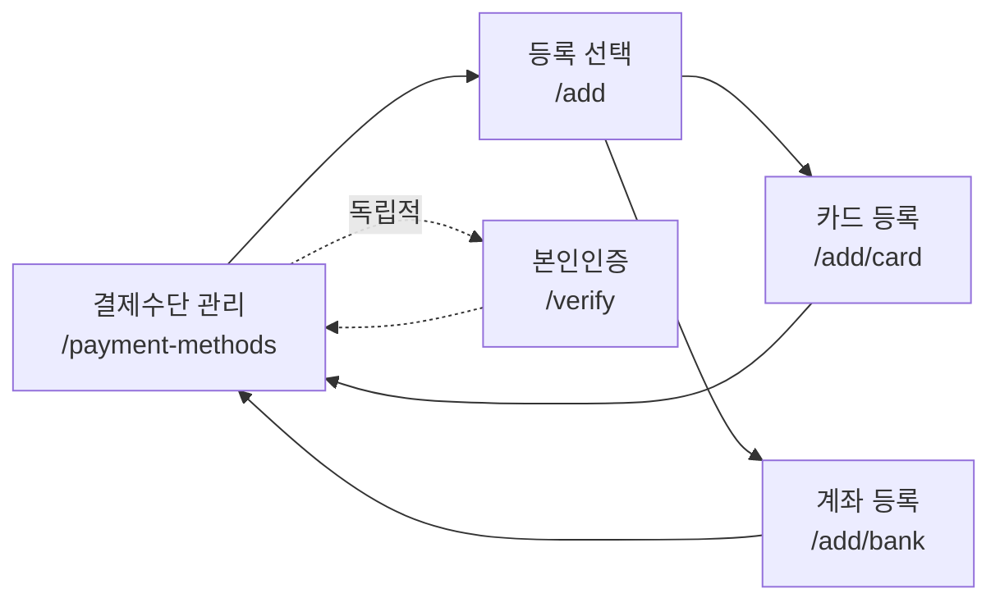
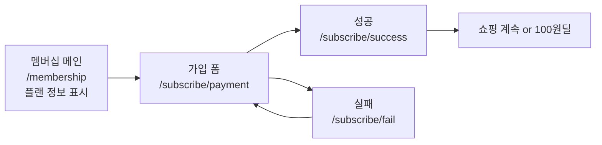

# Routing Audit & Refactoring Spec

_Date: 2025-10-29_  
_Scope: order, payment, membership 라우팅 재설계_

---

## 📋 요약

### 목표

현재 흐트러진 `payment`, `membership` 라우팅 구조를 정리하여 **직관적인 URL과 명확한 페이지 흐름**을 만듭니다.

### 범위

- ✅ `/mypage/payment` → `/mypage/payment-methods`
- ✅ `/mypage/membership` 구조 정리 (subscribe 플로우 추가)
- 🔄 `/order` 정리 (checkout-backup 삭제, address 정리)
- ✅ 기존 UI 디자인 보존 (파일명/경로만 변경)
- ❌ 비즈니스 로직/가드/API 호출 (추후 작업)

### 작업 방식

1. **복붙 우선**: 기존 페이지 복사 → 경로 변경 → 내부 링크 수정
2. **UI 불변**: 디자인/스타일 수정 금지
3. **단순 이동**: 버튼 클릭 → 페이지 이동만 구현

---

## 1️⃣ 현행 문제점

### A. payment 영역

```
/mypage/payment/
├── manage/          # 결제수단 목록
├── register/        # 등록 선택 (은행/카드)
├── card/            # 목적 불명확
├── form/            # 카드 등록 폼
└── phone/           # 본인인증
```

**문제**:

- `payment`가 너무 일반적 (나중결제인지 불명확)
- `phone` → 본인인증임을 알 수 없음
- `register` vs `form` 계층 관계 불명확

### B. membership 영역

```
/mypage/membership/
├── page.tsx         # 메인 (가입/해지 버튼)
├── fee-method/      # 회비 결제수단 관리
├── success/         # 가입 완료
├── fail/            # 가입 실패
└── test/            # 🚨 삭제 필요
```

**문제**:

- 가입 플로우가 파편화 (플랜 선택 페이지 없음)
- `success/fail`이 membership 직속 (subscribe 플로우 불명확)
- `test` 프로덕션 노출

---

## 2️⃣ 목표 구조

### A. payment-methods (나중결제 전용)

```
/mypage/payment-methods/
├── page.tsx                    # 목록 + 관리 (기존 manage)
├── add/
│   ├── page.tsx                # 선택 화면 (기존 register)
│   ├── card/
│   │   └── page.tsx            # 카드 등록 폼 → 등록 완료
│   └── bank/
│       └── page.tsx            # 계좌 등록 폼 → 등록 완료
└── verify/
    └── page.tsx                # 본인인증 (독립적, 필요 시 사용)
```

**주의**: `verify`는 카드/계좌 등록과 **독립적**입니다. 별도의 본인인증이 필요한 경우에만 사용됩니다.

### B. membership

```
/mypage/membership/
├── page.tsx                    # 메인 (플랜 정보 포함, 기존 유지)
├── subscribe/                  # 🆕 가입 플로우
│   ├── payment/                # 결제수단 선택 + 플랜 선택
│   │   ├── page.tsx            # 멤버십 가입 폼 (기존 /payment/form)
│   │   ├── components.tsx      # 폼 컴포넌트 (함께 이동)
│   │   └── formatted-input.tsx # 입력 컴포넌트 (함께 이동)
│   ├── success/
│   │   └── page.tsx            # 가입 완료 (기존 이동)
│   └── fail/
│       └── page.tsx            # 가입 실패 (기존 이동)
└── payment-method/             # 회비 결제수단 (기존 fee-method)
    └── page.tsx
```

**Note**:

- `/payment/form`이 실제 멤버십 가입 폼이었음
- 플랜 선택은 `membership/page.tsx`에 이미 UI 존재
- 신청하기 버튼 → `/subscribe/payment`로 직접 이동

### C. order

```
/order/
├── checkout/
│   └── page.tsx           # 주문/결제 페이지
├── checkout-backup/       # 🗑️ 삭제 대상
├── address/
│   ├── page.tsx           # 배송지 등록/수정
│   └── list/
│       └── page.tsx       # 배송지 목록/선택
├── payment/
│   └── page.tsx           # 결제 처리
├── complete/
│   └── page.tsx           # 주문 완료
└── track/
    └── page.tsx           # 배송 추적
```

**변경 사항**:

- `checkout-backup` 삭제 (백업 폴더)
- 나머지는 현재 구조 유지

---

## 3️⃣ 주요 플로우

### 플로우 1: 나중결제 수단 추가



**Note**: 카드/계좌 등록은 **"등록" 버튼**으로 완료되며, 본인인증은 필요 시에만 별도로 진행됩니다.

### 플로우 2: 멤버십 가입



**Note**: 플랜 선택과 결제수단 선택이 하나의 폼(`/subscribe/payment`)에 통합되어 있음

---

## 4️⃣ URL 변경표

| As-Is                           | To-Be                                  | 작업                   |
| ------------------------------- | -------------------------------------- | ---------------------- |
| `/mypage/payment/manage`        | `/mypage/payment-methods`              | 폴더 복사 + 리다이렉트 |
| `/mypage/payment/register`      | `/mypage/payment-methods/add`          | 이동                   |
| `/mypage/payment/form`          | `/mypage/payment-methods/add/card`     | 이동                   |
| `/mypage/payment/phone`         | `/mypage/payment-methods/verify`       | 이동                   |
| `/mypage/payment/card`          | **삭제**                               | manage와 중복          |
| `/mypage/membership/fee-method` | `/mypage/membership/payment-method`    | 폴더명 변경            |
| `/mypage/membership/success`    | `/mypage/membership/subscribe/success` | 이동                   |
| `/mypage/membership/fail`       | `/mypage/membership/subscribe/fail`    | 이동                   |
| `/mypage/membership/test`       | **삭제**                               | 프로덕션 제거          |
| `/mypage/payment/form`          | `/mypage/membership/subscribe/payment` | 이동 (멤버십 가입 폼)  |
| `/order/checkout-backup`        | **삭제**                               | 백업 폴더 제거         |

---

## 5️⃣ 리다이렉트 설정

`next.config.js`에 추가:

```typescript
async redirects() {
  return [
    // payment 관련
    {
      source: "/:countryCode/mypage/payment/manage",
      destination: "/:countryCode/mypage/payment-methods",
      permanent: true,
    },
    {
      source: "/:countryCode/mypage/payment/register",
      destination: "/:countryCode/mypage/payment-methods/add",
      permanent: true,
    },
    {
      source: "/:countryCode/mypage/payment/form",
      destination: "/:countryCode/mypage/payment-methods/add/card",
      permanent: true,
    },
    {
      source: "/:countryCode/mypage/payment/phone",
      destination: "/:countryCode/mypage/payment-methods/verify",
      permanent: true,
    },
    {
      source: "/:countryCode/mypage/payment/card",
      destination: "/:countryCode/mypage/payment-methods",
      permanent: true,
    },

    // membership 관련
    {
      source: "/:countryCode/mypage/membership/fee-method",
      destination: "/:countryCode/mypage/membership/payment-method",
      permanent: true,
    },
    {
      source: "/:countryCode/mypage/membership/success",
      destination: "/:countryCode/mypage/membership/subscribe/success",
      permanent: true,
    },
    {
      source: "/:countryCode/mypage/membership/fail",
      destination: "/:countryCode/mypage/membership/subscribe/fail",
      permanent: true,
    },
  ]
}
```

---

## 6️⃣ 작업 시 주의사항

### ✅ DO

- 기존 페이지 파일을 **mv 명령**으로 이동 (복사보다 효율적)
- 파일명을 kebab-case로 변경 (예: `page.tsx`)
- `<Link>` 태그의 `href` 속성만 수정
- 버튼 클릭 시 `router.push()` 경로만 수정
- **카드/계좌 등록 완료 시**: "등록" 버튼 → `/payment-methods` (목록으로 복귀)
- **본인인증**: 독립적 페이지로, 필요 시에만 별도 진입

### ❌ DON'T

- UI 디자인/스타일 수정 금지
- className, Tailwind 클래스 변경 금지
- 비즈니스 로직 추가 금지 (추후 작업)
- API 호출, 상태 관리 수정 금지
- 가드/인증 로직 추가 금지

### 예시 (링크 수정만)

```tsx
// Before
<Link href="/mypage/payment/register">결제수단 등록</Link>

// After
<Link href="/mypage/payment-methods/add">결제수단 등록</Link>
```

---

## 7️⃣ 완료 기준

각 task 완료 후:

1. 해당 경로로 접속 시 페이지가 정상 표시되는지 확인
2. 버튼 클릭 시 올바른 경로로 이동하는지 확인
3. 콘솔 에러 없는지 확인
4. **커밋** (작업 단위별)

---

**문서 끝**
